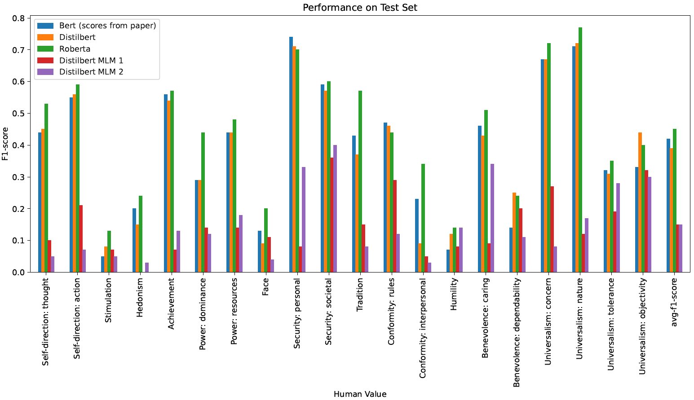
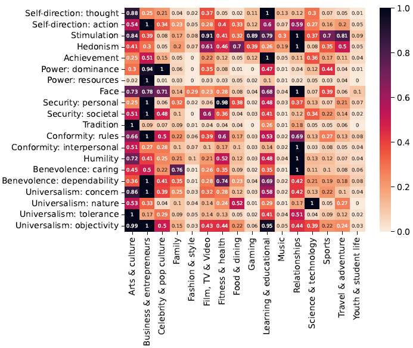

# Exploring differences in human values across debate topics on Reddit

Authors:
 - Alina Dima
 - Andreea Tudor
 - Lisa Koopmans
 - Nikolai Herrmann
 - Stefania Radu

 This repository contains the following:
 - [Models for human values classification](values_classification.ipynb)
    - Language models for multi-label classification
    - Language models for masked prediction

     
 - [Applying a fine-tuned model for topic prediction](topics.py)
 - [An analysis on the distribution of human values across different topics](value_topic_analysis.ipynb)
   
